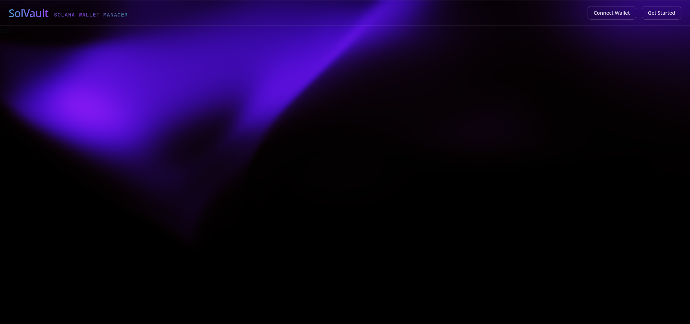

# SolVault

**SolVault: Your Solana wallets. Your total control. No KYC. No forced cloud.**

You may also find managing multiple Solana wallets inconvenient. SolVault is an application that lets you create and track your Solana wallets with a single click, stored in a local SQLite database to ensure no one can access your data. You can also export your wallet keys in KeePass format.

This first version focuses on simple and secure management. Future versions will include a graphing system to visualize interactions with your wallets (similar to Obsidian), an automatic wallet splitting system once a certain amount is reached, and conversions to BTC, stablecoins, and Monero.



## Features

- Wallet creation in one click (seed phrase + address)
- Live transaction and balance monitoring
- Local SQLite storage (100% your data)
- KeePass export (CSV/JSON secure)
- Ultra-fast inter-wallet transfers

## Installation

```bash
git clone https://github.com/Charlyhno-eng/solvault
cd solvault
npm install
cp .env.example .env.local
npm run dev
```

## Tech Stack

Next.js 15 + Tailwind + shadcn/ui
local SQLite
@solana/web3.js
